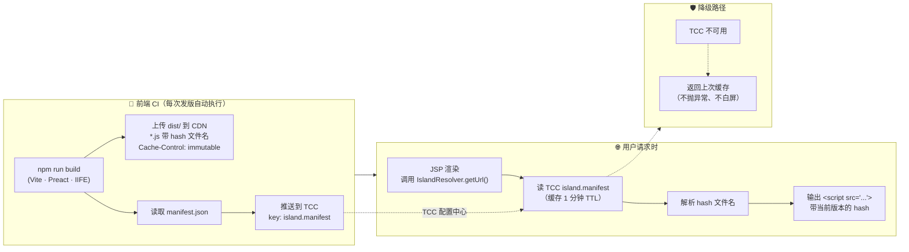

# 实施计划：B2B 平台前端架构渐进演进

## 前置分析

详见 [`analysis-entry-point.md`](./analysis-entry-point.md)。核心结论：

- **根因**：模块边界缺失 → UI 重复实现 + 状态多副本
- **切入点**：Zustand 状态治理（不依赖 React，零风险起步）
- **终态技术栈**：Preact + Zustand + TypeScript + Vite
- **试点**：审批流
- **策略**：寄生在业务需求中，不独立申请资源

---

## 完整演进路径

```
阶段 0：基线采集
  └── 扫描脚本 → 输出状态副本地图 + UI 重复度基线

阶段 1：Zustand 状态治理
  ├── jQuery 仍渲染 UI，但状态读写全部改走 Store
  ├── 不引入 React，零新依赖，零闪屏风险
  └── 解决：状态不一致 + 跨页面状态共享

阶段 1.5：局部 React Island（大页面中挑最痛的区块）
  ├── 一个区块只有一个主人：要么 JSP 渲染，要么 React 渲染，不同时存在
  ├── Feature flag 控制分支，降级 = 改配置切回 JSP 分支
  └── 解决：大页面中高痛点区块的 UI 重复 + 交付慢

阶段 2：全页 React 重写（中小页面、新页面）
  ├── Store 不变，全页走 React
  ├── Feature flag + 灰度发布，独立回滚
  └── 解决：整个页面的 UI 重复 + jQuery 退出

阶段 3：jQuery 全量退役
  ├── 最后一个页面 React 化后，移除 jQuery 依赖
  └── Store 从第一天到最后一天同一份代码
```

**阶段 1.5 和 2 不是二选一**，是按页面情况选用：大页面走 1.5（局部 Island），小页面/新页面走 2（全页 React）。

---

## 阶段 1：Zustand 状态治理

### 目标

将散落在 DOM、隐藏域、全局变量中的业务状态收拢到 Zustand Store，jQuery 代码改为读写 Store。**不引入 React。**

### 范围

审批流涉及的页面中，与"审批状态"相关的代码：

| 页面         | 改造内容                                         |
| ------------ | ------------------------------------------------ |
| 审批详情页   | 审批状态的读写改为走 Store，表单输入值保留在 DOM |
| 待办列表页   | 同上                                             |
| 已办列表页   | 同上                                             |
| 发起申请页   | 状态初始化改为 Store                             |
| 移动端审批页 | 同上                                             |

### Store 设计

```ts
// src/store/approvalStore.ts
import { create } from 'zustand';

export const useApprovalStore = create((set, get) => ({
  // 核心状态
  status: 'pending',  // pending | inReview | approved | rejected | withdrawn | executed
  orderId: null as string | null,
  operator: null as string | null,
  comment: '',

  // Actions
  submit: () => set({ status: 'inReview' }),
  assign: (reviewer: string) => set({ status: 'inReview', operator: reviewer }),
  approve: (operator: string, comment: string) => set({ status: 'approved', operator, comment }),
  reject: (operator: string, comment: string) => set({ status: 'rejected', operator, comment }),
  resubmit: () => set({ status: 'inReview', comment: '' }),
  withdraw: (operator: string) => set({ status: 'withdrawn', operator }),
  execute: (operator: string) => set({ status: 'executed', operator }),

  // 派生查询（jQuery 通过 getState() 消费）
  isEditable: () => ['pending', 'rejected'].includes(get().status),
  canApprove: () => get().status === 'inReview',
  statusLabel: () => {
    const labels = { pending: '待审', inReview: '审核中', approved: '已通过', rejected: '已驳回', withdrawn: '已撤回', executed: '已执行' };
    return labels[get().status];
  },
}));
```

### jQuery 改造前后对比

**改造前**（状态散落在多处）：

```js
// approval.js —— 改造前
window.ApprovalModule = (function() {
  var _status = 'pending';                         // ← 副本 1：全局变量

  function approve(operator, comment) {
    _status = 'approved';                          // ← 更新副本 1
    $('#approval-status').text('已通过');            // ← 副本 2：DOM 文本
    $('#hidden-status').val('approved');            // ← 副本 3：隐藏域
  }

  function getStatus() {
    return _status;                                // ← 返回副本 1，可能与其他不一致
  }

  return { approve: approve, getStatus: getStatus };
})();
```

**改造后**（单一 Store）：

```js
// approval.js —— 改造后
// Store 通过 <script> 标签在页面加载时引入

window.ApprovalModule = (function() {
  function approve(operator, comment) {
    useApprovalStore.getState().approve(operator, comment);  // ← 单一写入
  }

  function getStatus() {
    return useApprovalStore.getState().status;               // ← 单一读取
  }

  // DOM 同步：Store 变更 → 自动更新所有 DOM 展示位置
  useApprovalStore.subscribe(function(state) {
    $('#approval-status').text(state.statusLabel ? state.statusLabel() : state.status);
    $('#hidden-status').val(state.status);
  });

  return { approve: approve, getStatus: getStatus };
})();
```

### JSP 数据注入

JSP 只输出 JSON 数据层，不调用任何前端库方法。Store 初始化逻辑收敛在 Island/Handler JS 文件中。

```html
<!-- JSP：只输出纯 JSON 数据 -->
<script>
  window.$page = window.$page || {};
  window.$page.approval = {
    orderId: '<%= order.id %>',
    status: '<%= order.approvalStatus %>',
    operator: '<%= order.approvalOperator %>'
  };
</script>
```

```js
// approval.js 顶部 —— Store 初始化从 $page 读取
var pageData = window.$page && window.$page.approval;
if (pageData) {
  useApprovalStore.setState({
    status: pageData.status,
    orderId: pageData.orderId,
    operator: pageData.operator || null
  });
}
```

### 关键边界

```
Store 管理的内容：
  ├── 业务状态流转（审批状态、操作人、操作时间）
  └── 跨页面共享的业务数据

Store 不管理的内容：
  ├── 用户在 textarea 中的即时输入（submit 时从 DOM 一次性读取）
  ├── 用户在 input 中选择的日期
  └── 任何瞬时 UI 交互状态

表单输入值留在 DOM 中，提交时读取。
只有跨页面、跨时间、多副本的业务状态才进 Store。
```

### 量化产出

- 状态源数量：改造前 N 个副本 → 改造后 1 个 Store
- 跨页面状态一致性：审批详情页操作 → 待办列表页自动感知（同一 Store）

---

## 阶段 1.5：局部 React Island

### 适用场景

大 JSP 页面（3000+ 行，10+ 个业务区块），整体改造链路长、回归成本高。挑最痛的 1-2 个区块用 React 替换。

### 核心原则：岛内独治，岛外不动

```
之前错误的设计（已废弃）              正确设计

JSP DOM 和 React DOM               Feature flag 控制：
在同一个区域内并存                    分支 A（react）→ 空 div + React 填充
display 切换                         分支 B（jquery）→ JSP 渲染旧 HTML
两棵 DOM 树                           一个区域只有一个主人
同步噩梦                              不存在同步问题
```

### 统一路由设计：island-router.jsp

Island 和全页 React 使用同一套路由机制。差异只在于 fallback JSP 的内容范围，路由逻辑完全一致。

**JSP 改动的最小单元**：原来 50 行 HTML+jQuery 区块 → 1 行 router include。

```jsp
<%-- order/detail.jsp 改造后 --%>

<%-- 数据层（JSP 负责，不变）--%>
<script>
  window.$page = window.$page || {};
  window.$page.approval = {
    orderId: '<%= order.id %>',
    status: '<%= order.approvalStatus %>',
    operator: '<%= order.approvalOperator %>'
  };
</script>

<!-- 区块 1：采购信息（jQuery，不动） -->
<%@ include file="procurement.inc.jsp" %>

<!-- 区块 2：审批状态 —— 1 行 router 替代原来 50 行 -->
<jsp:include page="/WEB-INF/includes/island-router.jsp">
  <jsp:param name="route" value="approval-status"/>
</jsp:include>

<!-- 区块 3：物流信息（jQuery，不动） -->
<%@ include file="logistics.inc.jsp" %>
```

### island-router.jsp 运行原理

服务端决策，不在客户端做二次替换。

```mermaid
sequenceDiagram
    participant Browser as 🌐 浏览器
    participant JSP as 📄 JSP 页面
    participant Router as 🔀 island-router.jsp
    participant TCC as ⚙️ TCC 配置中心
    participant Fallback as 📁 fallback/xxx.jsp

    Browser->>JSP: GET /order/detail?id=123
    JSP->>JSP: 输出 window.$page = {...}<br/>（数据层，两个分支共享）

    JSP->>Router: &lt;jsp:include route="approval-status"/&gt;

    Router->>TCC: ConfigService.getJsonMap("island.routes")
    alt TCC 正常
        TCC-->>Router: { renderer: "react", island: "approvalStatus", traffic: 0.5 }
        Router->>Router: hash(userId + ":" + route) % 100<br/>bucket = 42
        Router->>Router: useReact = "react" == renderer<br/>  && bucket < traffic × 100

        alt useReact == true
            Router-->>Browser: 输出：空 &lt;div id="root"&gt;<br/>+ vendor.hash.js<br/>+ island.hash.js<br/>+ mount 调用
            Note over Browser: ~230ms 后 React 渲染完成
        else useReact == false
            Router->>Fallback: &lt;jsp:include fallback/approval-status.jsp/&gt;
            Fallback-->>Browser: 输出：完整 HTML + jQuery 事件绑定<br/>（旧代码完整保留）
        end

    else TCC 不可用
        TCC-->>Router: null / 异常
        Router->>Fallback: 默认走 jQuery 分支
        Fallback-->>Browser: 输出：完整 HTML + jQuery 事件绑定
        Note over Router,Browser: 降级：不依赖 TCC 即可正常渲染
    end
```

实现代码：

```jsp
<%-- /WEB-INF/includes/island-router.jsp --%>
<%
  String route = request.getParameter("route");
  Map<String, Map<String, Object>> routes = ConfigService.getJsonMap("island.routes");
  Map<String, Object> cfg = routes != null ? routes.get(route) : null;

  String renderer = cfg != null ? (String) cfg.getOrDefault("renderer", "jquery") : "jquery";
  double traffic  = cfg != null ? ((Number) cfg.getOrDefault("traffic", 1.0)).doubleValue() : 1.0;
  String island   = cfg != null ? (String) cfg.get("island") : null;

  // 灰度决策：确定性哈希（分布式一致，零服务端状态）
  String userId = getUserId(request);
  String seed   = userId + ":" + route;
  int bucket    = Math.abs(seed.hashCode()) % 100;
  boolean useReact = "react".equals(renderer) && bucket < (int)(traffic * 100);

  if (useReact && island != null) {
%>
    <%-- 分支 A：React。JSP HTML 不生成，只出空容器 --%>
    <div id="island-root-<%= route %>"></div>
    <script src="<%= IslandResolver.getUrl("vendor") %>"></script>
    <script src="<%= IslandResolver.getUrl(island) %>"></script>
    <script>
      (function() {
        var ns = window.__islands && window.__islands['<%= island %>'];
        if (ns && ns.mount) ns.mount('#island-root-<%= route %>');
      })();
    </script>
<%
  } else {
%>
    <%-- 分支 B：jQuery。直接 include fallback JSP --%>
    <jsp:include page="/WEB-INF/includes/fallback/<%= route %>.jsp" />
<%
  }
%>
```

**一次请求一个分支，另一分支的代码浏览器从未收到。**

### 确定性哈希：分布式一致

| 机制 | 问题 | 修正 |
|---|---|---|
| Session 存储选择 | 负载均衡到不同服务器 → 结果不一致 | ❌ |
| 确定性哈希 | `hash(userId + route) % 100`，各节点独立计算得相同结果 | ✅ |

同一用户对同一 route 永远落在同一个 bucket，与打到哪台服务器无关。零复制、零黏性、零额外存储。

### 开发调试

优先级：Query Param > DEV Cookie > 确定性哈希

```jsp
<%
  boolean useReact;

  // 1. Query Param（最高优先级，显式切换，可分享 URL）
  String qpOverride = request.getParameter("__r_" + route);
  if (qpOverride != null) {
    useReact = "react".equals(qpOverride);

  // 2. DEV 环境持久 cookie
  } else if (isDevEnv()) {
    String cookieVal = getCookie(request, "__island_" + route);
    useReact = cookieVal != null ? "react".equals(cookieVal) : hashDecision(userId, route, traffic);

  // 3. 生产环境：确定性哈希
  } else {
    useReact = hashDecision(userId, route, traffic);
  }
%>
```

DEV 环境右下角注入调试面板：下拉选择 react/jquery → 写 cookie → 自动刷新。QA 回归用 `?__r_approval-status=react` 分享带参数的 URL，一个 tab 测 React，一个 tab 测 jQuery。

### TCC 配置 island.routes

```json
{
  "approval-status": {
    "renderer": "react",
    "island": "approvalStatus",
    "traffic": 0.1
  },
  "approval-page": {
    "renderer": "jquery",
    "island": "approvalPage",
    "traffic": 0
  }
}
```

灰度放量全程纯配置：`traffic: 0.01 → 0.1 → 0.5 → 1.0`，秒级生效，零部署。

### 降级方式

```
出问题 → TCC 改 renderer: "jquery" → 秒级生效 → 用户刷新即恢复
  不需要代码回滚，不需要部署
  fallback JSP 一直存在于 /WEB-INF/includes/fallback/ 目录，router 切回即用
```

### Island vs 全页的统一

| | Island（局部） | 全页 React |
|---|---|---|
| JSP 改动量 | 1 行 router include | 1 行 router include |
| router 差异 | 无 | 无。同一套路由逻辑 |
| fallback JSP | 一个区块的 HTML | 整个页面的 HTML |
| 从 Island 升级到全页 | JSP 结构从多个 include 收敛为一个。一次 Java 上线，之后零改动 |

---

## 阶段 2：全页 React 重写

### 适用场景

- 独立小页面（页面本身边界清晰，整体替换成本低）
- 全新页面（没有 JSP 历史包袱）
- 局部 Island 积累足够后，某个页面的所有区块 React 化完毕 → 升级为全页 React

### 机制

与阶段 1.5 **同一套 island-router.jsp**。区别仅在于 JSP 侧 include 的位置和 fallback JSP 的内容范围。

阶段 1.5（多个局部 Island）→ 阶段 2（一个全页 React）的升级路径：
- JSP 中将多个 `island-router.jsp` include 收敛为一个 page 级 include
- 一次 Java 上线。之后切换/灰度/回滚全部纯配置

### 灰度发布

```
Day 1：内部用户 100%
Day 3：1% 真实用户
Day 5：10%
Day 7：50%
Day 10：100%
Day 30：清理旧代码
```

---

## 构建与部署

### 技术栈

| 组件     | 选择                              | 理由                                        |
| -------- | --------------------------------- | ------------------------------------------- |
| UI 框架  | Preact（preact/compat）           | API 与 React 完全兼容，体积 ~5KB gzipped    |
| 状态管理 | Zustand                           | 框架无关 API（jQuery + React 双消费），~1KB |
| 构建工具 | Vite（lib mode，IIFE 输出）       | 配置简单，构建快                            |
| 类型系统 | TypeScript（React Island 中使用） | 编译期错误检查，AI 最友好的范式             |

### 构建产出

```
前端 CI（Vite build）产出：

  dist/
    islands/
      approvalStatus.d4e5f6a.js   ← hash 文件名，Cache-Control: immutable
      todoList.a1b2c3d.js
      approvalPage.b3c4d5e.js
    vendor/
      vendor.1a2b3c4.js            ← Preact + Zustand，大版本不变 hash 不变
    manifest.json
```

### Manifest + TCC 寻址

**JSP 不写死文件名，不引入构建 hash。通过 TCC 配置中心动态寻址。**

```json
// manifest.json（前端构建产出）
{
  "approvalStatus": "islands/approvalStatus.d4e5f6a.js",
  "todoList": "islands/todoList.a1b2c3d.js",
  "approvalPage": "islands/approvalPage.b3c4d5e.js",
  "vendor": "vendor/vendor.1a2b3c4.js"
}
```

**部署流水线**：



**详细步骤**：

```
前端 CI：
  1. npm run build
  2. 上传 dist/ 到 CDN（islands/*.js 带 hash，Cache-Control: immutable）
  3. 读取 manifest.json → 推送到 TCC 配置中心 key：island.manifest
  4. Java 零操作

用户请求：
  1. JSP 渲染时 IslandResolver 从 TCC 读取 island.manifest
  2. 解析 manifest → 拿到当前 hash 文件名
  3. 输出 <script src="https://cdn.example.com/dist/islands/approvalStatus.d4e5f6a.js">
```

### Java 侧 IslandResolver

```java
// 一次实现，全局复用。后续所有 Island 页面零新增成本
public class IslandResolver {
    private static volatile Map<String, String> cache;
    private static volatile long lastRefresh = 0;
    private static final long TTL = 60_000;  // 本地缓存 1 分钟

    public static String getUrl(String islandName) {
        String hash = getManifest().get(islandName);
        if (hash != null) {
            return "/dist/" + hash;
        }
        // 降级：manifest 读取失败 → 返回上次缓存的旧版本
        // 不发生白屏
        return cache != null
            ? "/dist/" + cache.getOrDefault(islandName, "islands/" + islandName + ".js")
            : "";
    }

    private static Map<String, String> getManifest() {
        if (cache != null && System.currentTimeMillis() - lastRefresh < TTL) {
            return cache;
        }
        try {
            String json = TCCClient.get("island.manifest");
            cache = JsonParser.parseMap(json);
            lastRefresh = System.currentTimeMillis();
        } catch (Exception e) {
            log.error("读取 island.manifest 失败，使用上次缓存", e);
            // 不置空 cache —— 降级用旧版本
        }
        return cache != null ? cache : Map.of();
    }
}
```

### Java 侧一次性投入

| Java 团队付出 | 获得 |
|---|---|
| 实现 IslandResolver（约 30 行） | 前端后续所有发版不再需要 Java 部署 |
| 实现 island-router.jsp（约 50 行） | 后续所有页面切换/灰度/回滚纯配置，零 Java 上线 |
| 创建 /WEB-INF/includes/fallback/ 目录 | 一次约定，所有 fallback JSP 按 route name 自动寻址 |
| 注册 TCC: island.manifest | 前端版本动态寻址 |
| 注册 TCC: island.routes | 集中路由配置（renderer + island + traffic） |

### TCC 配置清单

```
island.manifest  → 前端构建自动维护
  { "approvalStatus": "islands/approvalStatus.d4e5f6a.js", "vendor": "vendor/vendor.1a2b3c4.js" }

island.routes    → 运维/开发维护
  { "approval-status": { "renderer": "react", "island": "approvalStatus", "traffic": 0.5 } }
```

### 各阶段 Java 改动量

```
试点一次性准备：
  实现 IslandResolver + island-router.jsp + TCC 配置注册
  → 一次 Java 上线

每接入一个新页面/区块：
  原 JSP 中替换对应区块为 <jsp:include page="island-router.jsp"> + 搬旧 HTML 到 fallback/xxx.jsp
  + island.routes 加一条路由（TCC，无需上线）
  → 每个页面一次 Java 上线

jquery ↔ react 切换：
  TCC 改 renderer 值 → 秒级生效
  → 零 Java 上线

灰度放量 1%→10%→50%→100%：
  TCC 改 traffic 值 → 秒级生效
  → 零 Java 上线

前端发版：
  npm build → CDN → TCC manifest
  → 零 Java 上线

故障回滚：
  TCC 改 renderer="jquery" → 秒级生效
  → 零 Java 上线

局部 Island → 全页 React 升级：
  JSP 结构从多个 include 收敛为一个
  → 一次 Java 上线
```

---

## TTI 优化

### 全球访问下的体积策略

| 选择                | Gzipped  | 3G 下载时间 | TTI 增量  |
| ------------------- | -------- | ----------- | --------- |
| React + ReactDOM    | ~45KB    | ~1.5s       | +1.7~2.0s |
| **Preact + compat** | **~5KB** | **~0.16s**  | **+0.2s** |

**结论**：全球场景下 Preact 是必选，不是可选。Vite alias 一行切换，零改造成本。

```js
// vite.config.ts
resolve: {
  alias: { 'react': 'preact/compat', 'react-dom': 'preact/compat' }
}
```

### 加载策略

- **不全局引入**：vendor.js 不在 header.jsp 中加载，只在有 Island 的页面按需加载
- **preload 预加载**：`<link rel="preload" as="script" href="/dist/vendor.js">`
- **async 不阻塞**：`<script async src="...">`
- vendor.js（Preact+Zustand，~5KB）Cache-Control：30 天。Island 文件带 hash，Cache-Control：immutable

### 未改造页面的影响

不加载 vendor.js 的页面：**TTI 零影响。**

---

## 可用性保障

### 三层保障体系

```
第 1 层：island.routes 集中路由（服务端）
  island-router.jsp 根据 TCC 配置决定走 React 还是 jQuery 分支
  出问题：TCC 改 renderer="jquery" → 秒级生效 → 用户刷新即恢复
  不需要代码回滚，不需要部署
  fallback JSP 始终存在于 /WEB-INF/includes/fallback/ 目录，切回即用

第 2 层：IslandResolver + Manifest 降级链（服务端）
  TCC 不可用 → IslandResolver 返回上次缓存的 manifest（不抛异常）
  island.routes 不可用 → island-router.jsp 默认走 jQuery 分支
  任何服务端环节失败都不会导致白屏

第 3 层：ErrorBoundary 错误隔离（客户端）
  每个 Island 包裹 ErrorBoundary
  React 崩溃 → 返回 null，该区域空白，不影响页面其他区域
  崩溃事件上报监控，触发告警 → 运维评估是否切回 jQuery 分支
  注意：ErrorBoundary 无法恢复出 JSP 内容（React 分支中 JSP 内容从未下发到浏览器）
  真正的恢复依赖第 1 层：TCC 切 renderer="jquery" + 用户刷新
```

### 降级路径对比

| 场景 | 表现 | 恢复方式 |
|---|---|---|
| Island JS 加载失败（网络/CDN） | React 分支：空 div 可见，审批面板区域空白 | 运维改 TCC renderer="jquery" → 用户刷新 |
| Island 运行时崩溃 | ErrorBoundary 捕获，返回 null，区域空白；上报监控告警 | 运维评估后改 TCC renderer="jquery"（非自动） |
| 需要全局回滚 React | TCC 改 renderer="jquery"，秒级切回 | 运维操作 |
| TCC 不可用 | IslandResolver 返回缓存 manifest；routes 降级走默认 jquery | 自动 |
| 开发调试 | Query Param `?__r_approval-status=react\|jquery` | 开发者手动 |

### 页面加载时间线

```
用户打开审批详情页：

  T=0      JSP 渲染 HTML（服务端，立即可见）
           用户看到页面，可以开始操作

  T=~150ms vendor.js 下载完成（preload + 5KB + CDN）
  T=~180ms Parse + Execute 完成
  T=~200ms Island.js 下载完成
  T=~230ms React 渲染完成，用户看到增强 UI

  全程无闪屏（React 渲染到独立的空 div）
  全程 jQuery 分支始终在 else 中备着
  全程 JSP 是功能的兜底
```

---

## 量化框架

### 分层指标体系

**层 1：Core Web Vitals**（所有页面，含未改造页面）

```js
// 在 header.jsp 引入（仅 1KB 的 web-vitals 子集，或自写轻量版）
// 指标：FCP / LCP / INP / CLS
// 维度：{ page, islandEnabled, connectionType, region }
// 采样率：10%
```

**层 2：Island 自定义指标**

| 指标            | 采集方式                            | 用途                        |
| --------------- | ----------------------------------- | --------------------------- |
| Island 加载时间 | Performance API mark/measure        | 监控构建产物体积和 CDN 性能 |
| Island 渲染时间 | Performance API                     | 监控组件复杂度              |
| 降级/崩溃率     | ErrorBoundary + script.onerror 埋点 | 告警阈值驱动回滚决策        |

**层 3：业务体验指标**

| 指标           | 采集方式                          | 用途         |
| -------------- | --------------------------------- | ------------ |
| 操作完成时间   | 从点击"通过"到看到结果的 duration | 对比改造前后 |
| 页面任务成功率 | 提交成功数 / 提交尝试数           | 对比改造前后 |

### 阶段量化侧重点

| 阶段                    | 主测量指标                   | 采集方式             |
| ----------------------- | ---------------------------- | -------------------- |
| 阶段 0（基线）          | 状态源数量、UI 实现重复度    | 扫描脚本             |
| 阶段 1（Zustand）       | 状态源数量                   | 改造前基线 vs 改造后 |
| 阶段 1.5（局部 Island） | UI 实现重复度、Island 覆盖率 | 扫描脚本 + 埋点      |
| 阶段 2（全页 React）    | 缺陷密度、操作完成率         | 同口径对比           |
| 阶段 3（退役）          | 代码行数、包体积             | 静态分析             |

### 说服链

```
阶段 1 数据："审批状态源从 7 个副本变为 1 个 Store"
     ↓ 说服：状态不一致的根因已消除

阶段 1.5 数据："审批面板 UI 从 7 处独立实现 → 1 个 Island + 7 处引用"
     ↓ 说服：改一个字段不再需要改 7 个位置

阶段 2 数据："改造后缺陷密度 X bugs/需求 → Y bugs/需求，操作完成率 +Z%"
     ↓ 说服：量化的质量提升

管理层/业务方认可 → 争取更多资源 → 加速推进
```

---

## 审批流试点

### 试点卡片

```
试点：审批流

范围（最小可行）：
  MR 1（阶段 1）：审批详情页 + 待办列表页 Zustand Store 化
  MR 2（阶段 1.5 或 2*）：审批状态面板 React Island 化

  * 如果审批详情是独立小页面 → 走阶段 2（全页 React）
  * 如果审批面板嵌在大订单详情页 → 走阶段 1.5（局部 Island）

改造前基线（由扫描脚本产出）：
  - 审批状态在多少个独立位置存储
  - 审批状态 UI 在多少个页面独立实现

改造后目标：
  - 1 个 Zustand store（useApprovalStore）
  - jQuery 仍渲染 UI（阶段 1）；React 逐步接管 UI（阶段 1.5/2）
  - Store 从第一天到最后一天同一份代码

时间：寄生在下一个审批相关的业务需求中
后端依赖：阶段 1 零后端依赖；阶段 1.5+ 需要 Java 团队实现 IslandResolver（一次性投入）
```

---

## 子任务分解

每个子任务为独立 markdown 文件，位于 `tasks/` 目录，包含：目标、依赖、步骤、里程碑、量化指标、验收标准。

### 依赖关系

```
┌───────────────┐   ┌───────────────┐
│ 任务 00        │   │ 任务 03        │
│ 基线采集       │   │ Vite+Preact    │
│ 扫描脚本       │   │ Manifest       │
└──────┬────────┘   └──────┬────────┘
       │                   │
       └────────┬──────────┘
                ▼
         ┌─────────────┐
         │ 任务 01       │  ← 与 03 可并行
         │ Store 设计    │
         │ Zustand      │
         └──────┬──────┘
                │
      ┌─────────┼─────────┐
      ▼         ▼         ▼
┌──────────┐ ┌──────────┐ ┌──────────┐
│ 任务 02   │ │ 任务 05   │ │ 任务 04   │  ← 三者可并行
│ jQuery   │ │ Island   │ │ Resolver  │
│ Store 化  │ │ 组件开发  │ │ + Router  │
└────┬─────┘ └────┬─────┘ └────┬─────┘
     │            │            │
     └────────────┼────────────┘
                  ▼
           ┌─────────────┐
           │ 任务 06       │
           │ Router 集成   │
           │ + Fallback JSP│
           └──────┬──────┘
                  ▼
           ┌─────────────┐
           │ 任务 07       │
           │ 集成+量化+灰度 │
           └─────────────┘
```

### 任务清单

| # | 任务 | 文件 | 依赖 | 可并行 |
|---|---|---|---|---|
| 00 | 基线采集 | [`task-00-baseline.md`](../tasks/task-00-baseline.md) | 无 | ✅ 与 03 并行 |
| 01 | Zustand Store 设计 | [`task-01-zustand-store.md`](../tasks/task-01-zustand-store.md) | 00 | — |
| 02 | jQuery Store 化 | [`task-02-jquery-refactor.md`](../tasks/task-02-jquery-refactor.md) | 01 | ✅ 与 03,04,05 并行 |
| 03 | Vite+Preact 构建链 | [`task-03-vite-preact-build.md`](../tasks/task-03-vite-preact-build.md) | 无 | ✅ 与 00,02 并行 |
| 04 | IslandResolver + Router | [`task-04-island-resolver.md`](../tasks/task-04-island-resolver.md) | 03 | ✅ 与 02,05 并行 |
| 05 | React Island 组件 | [`task-05-react-island.md`](../tasks/task-05-react-island.md) | 01,03 | ✅ 与 02,04 并行 |
| 06 | Router 集成 + Fallback JSP | [`task-06-feature-flag-jsp.md`](../tasks/task-06-feature-flag-jsp.md) | 02,04,05 | — |
| 07 | 集成+量化+灰度 | [`task-07-integration-qa.md`](../tasks/task-07-integration-qa.md) | 06 | — |
| 08 | 质量保障体系 | [`task-08-quality.md`](../tasks/task-08-quality.md) | 01,02,05 | ✅ 随代码产出并行编写 |

### 并行建议

```
Wave 1（立即并行）：
  任务 00（基线采集）              ← 开发者 A
  任务 03（Vite + Preact）         ← 开发者 B

Wave 2（00 完成后）：
  任务 01（Store 设计）            ← 开发者 A + B 共同 review

Wave 3（01 完成后并行）：
  任务 02（jQuery Store 化）      ← 开发者 A（熟悉现有审批逻辑）
  任务 05（React Island）         ← 开发者 B（熟悉 React）
  任务 04（Resolver + Router）    ← Java 开发者（一次性，后续零成本）
  任务 08（Store 测试 + 组件测试） ← 随 02/05 代码产出同步编写
  注：任务 03 在 Wave 1 已完成，任务 02/04/05/08 可同时启动

Wave 4（02+04+05 完成后）：
  任务 06（Router 集成 + Fallback JSP）← 开发者 A + B
  任务 08（E2E 用例 + 视觉回归）       ← 随 06 集成后补充

Wave 5（06 完成后）：
  任务 07（集成+量化+灰度）        ← 开发者 A + B
```

---

## 风险与应急预案

| 风险                                         | 概率             | 影响 | 应对                                                                       |
| -------------------------------------------- | ---------------- | ---- | -------------------------------------------------------------------------- |
| vendor.js + Island 体积导致全球用户 TTI 退化 | 低（Preact 5KB） | 中   | 试点阶段实测 P75 TTI，如退化 > 300ms，进一步代码分割                       |
| Feature flag TCC 配置延迟导致版本错位        | 中               | 中   | IslandResolver 本地缓存 1 分钟 TTL + getUrl 降级返回缓存值                 |
| 业务方近期无审批相关需求                     | 中               | 中   | 退而审批 bug fix 或审批优化小需求做寄生载体                                |
| Java 团队拒绝实现 IslandResolver             | 低               | 中   | 短期用无 hash 文件名（Cache-Control: max-age=600），用数据说明收益后再说服 |
| 审批状态逻辑比推断更复杂                     | 中               | 低   | Zustand store 扩展性好，增量添加 state/action 即可                         |
| AI 生成的 React 组件与 JSP 行为不一致        | 中               | 中   | Feature flag 先在内部验证一个迭代周期，不可见差异逐一修复                  |

---

## 后续规划

本试点完成后，根据量化数据决定下一步优先级：

1. 审批流其他页面 Island 化（已办列表、移动端审批、发起申请）
2. 横向复制审批流模式到其他模块（订单审批、合同审批、资质审批）
3. 其他横向能力 Island 化（待办列表、通知中心、文件上传）

完整的阶段演进路径见[完整演进路径](#完整演进路径)。
