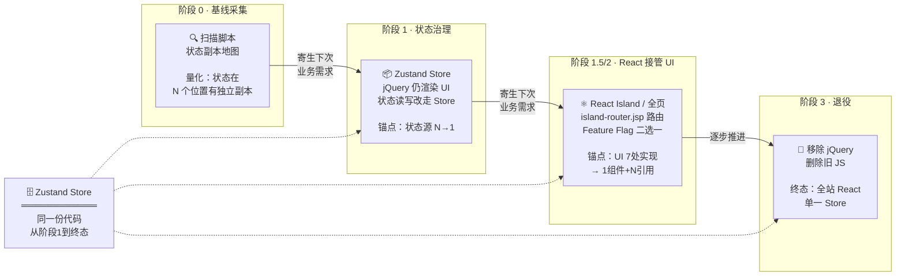

# 前端架构渐进演进方案

> 面向管理层和业务方的决策材料。技术设计和实施细节见 [`plan.md`](./plan.md) 和 [`tasks/`](./tasks/) 目录。

---

## 一句话结论

**以审批流为试点，在下次业务需求中寄生引入 Zustand 状态管理 + React Island 组件化，额外投入可控（后端一次性 ~1 人天，前端改造在业务需求排期内消化）。出问题可通过配置切回旧版本，秒级生效。试点成功后，横向复制到订单、合同、物流等模块，逐步消灭前端重复实现和质量失控。**

---

## 1. 为什么要做

### 1.1 五个真实问题，同一个根因

当前 B2B 平台（Java EE + jQuery，30+ 模块，5 年生产运行）面临的核心矛盾：

> 业务需求持续涌入，但交付速度从"两周一个迭代"降至"两个月难以交付一个小变更"。

五个具体问题：

| #   | 问题                               | 现状                                                                                       |
| --- | ---------------------------------- | ------------------------------------------------------------------------------------------ |
| 1   | **改一个字段要搜 12 个文件**       | 同一字段的 UI 在新增页、编辑页、详情页、导入页、导出模板、移动端审批页等 9+ 个位置独立实现 |
| 2   | **页面显示已通过，后台却是待审**   | 审批状态散落在 DOM、隐藏域、多个 JS 全局变量中，各自独立维护                               |
| 3   | **审批人点驳回没反应**             | 交互逻辑深度依赖 DOM 可见性和脚本加载顺序，偶发问题不可复现                                |
| 4   | **两人同时操作互相覆盖，数据丢失** | 无前端冲突检测，操作者只看到"保存失败"，实际已造成数据不一致                               |
| 5   | **新人三个月才能独立改一个页面**   | 模块间通过全局类名隐式耦合，修改影响面无法评估，全靠老员工经验                             |

**这五个问题不是五个独立问题，而是"模块边界缺失"这一个根因的五种症状。**

```
                  无模块边界（根因）
                        │
   ┌────────┬───────────┼───────────┬──────────┐
   ▼        ▼           ▼           ▼          ▼
UI重复实现  状态不一致  交互失效   并发丢数据  上手困难
```

详细诊断见 [`analysis-entry-point.md §1.3`](./analysis-entry-point.md#13-根因推导)。

### 1.2 不解决的代价

- 每个新字段、新需求都在 9+ 个位置重复造轮子，bug 数随功能线性增长
- 老员工离职带走隐性知识，新人需要 3 个月才能独立产出
- 竞品可能在做同样的事——如果对手先完成了现代化改造，交付效率和体验差距会持续拉大

---

## 2. 方案概要

### 2.1 核心思路：寄生式演进，每次只做一小块

不是"停下来花半年重构"，而是**每次业务需求中捎带改造一小块**——哪个页面这次要改业务逻辑，就把哪个页面的状态管起来、UI 组件化。



关键原则：
- **不产生二次迁移**：Zustand Store 从阶段 1 到终态同一份代码，jQuery 通过 `getState()/setState()` 读写，React 通过 `useStore()` 消费，只换 UI 层
- **阶段 1.5 和 2 按页面情况选用**：大页面走局部 Island，小页面/新页面走全页 React
- **每一轮寄生在业务需求中**，不独立申请资源
- **每次提交带量化数据**，积累说服链

### 2.2 为什么安全

核心机制：**服务端决策，一个请求只走一条分支。另一分支的代码浏览器从未收到。**

```
                        用户请求 /order/detail?id=123
                                  │
                                  ▼
                     ┌─────────────────────────┐
                     │    JSP 服务端渲染         │
                     │                         │
                     │  window.$page = {...}    │  ← 数据层（两个分支共享）
                     │                         │
                     │  <jsp:include page=      │
                     │    "island-router.jsp"   │  ← 1 行 router 替代原 45 行 if/else
                     │    route=approval-status │
                     │  />                      │
                     └────────────┬────────────┘
                                  │
                                  ▼
                     ┌──────────────────────────────┐
                     │    island-router.jsp          │
                     │                              │
                     │  1. 读 TCC island.routes      │
                     │     ↓                         │
                     │  2. 取 renderer + traffic     │
                     │     ↓                         │
                     │  3. hash(userId+route) % 100  │  ← 确定性哈希（分布式一致）
                     │     ↓                         │
                     │  4. bucket < traffic×100 ?    │
                     │                              │
                     │     YES ────────── NO ────────│
                     └────────┬─────────────┬────────┘
                              │             │
              ┌───────────────┘             └───────────────┐
              ▼                                             ▼
   ┌──────────────────────┐                    ┌──────────────────────┐
   │  分支 A：React        │                    │  分支 B：jQuery       │
   │                      │                    │                      │
   │  <div id="root">     │                    │  <jsp:include        │
   │  </div>              │                    │    fallback/         │
   │  <script src="       │                    │    approval-status   │
   │    vendor.hash.js">  │                    │    .jsp />           │
   │  </script>           │                    │                      │
   │  <script src="       │                    │  完整的旧 HTML        │
   │    island.hash.js">  │                    │  + jQuery 事件绑定   │
   │  </script>           │                    │                      │
   │                      │                    │  ← JSP 兜底内容       │
   │  ← JSP 只出空容器     │                    │    从未被删除          │
   │    无 JSP HTML        │                    │                      │
   └──────────┬───────────┘                    └──────────┬───────────┘
              │                                          │
              ▼                                          ▼
   ┌──────────────────────┐                    ┌──────────────────────┐
   │  浏览器              │                    │  浏览器              │
   │  · 空 div（~230ms）  │                    │  · 完整 HTML 立即可见 │
   │  · 下载 vendor.js    │                    │  · jQuery 事件就绪    │
   │  · 下载 island.js    │                    │                      │
   │  · React 渲染 → 完成  │                    │  零新依赖加载         │
   └──────────────────────┘                    └──────────────────────┘

  降级路径（任一环节失败）：
  · TCC 不可用 → island-router.jsp 默认走 jQuery 分支（不抛异常）
  · island.manifest 读取失败 → 使用上次缓存（不白屏）
  · Island JS 加载失败 → 空 div + 监控告警 → 运维评估是否切 TCC
  · React 运行时崩溃 → ErrorBoundary 捕获 + 监控告警 → 运维切 TCC
```

| 保障机制         | 说明                                                                                          |
| ---------------- | --------------------------------------------------------------------------------------------- |
| **服务端二选一** | 一个区域要么 jQuery 渲染要么 React 渲染，不同时存在——无 DOM 同步问题                          |
| **配置级回滚**   | 出问题 → TCC 改 `renderer: "jquery"` → 秒级生效，后续请求走旧版本。已遇到问题的用户需刷新恢复 |
| **确定性灰度**   | `hash(用户ID + 路由名) % 100`，同一用户始终看到同一版本，多服务器结果一致，零额外存储         |
| **三层降级**     | ① TCC 不可用→默认走 jQuery ② manifest 缓存过期→用上次缓存 ③ React 崩溃→ErrorBoundary 隔离     |
| **开发调试**     | URL 加 `?__r_审批=react` 强制切换，优先级高于哈希和配置                                       |

### 2.3 全球访问性能

React（~45KB gzipped）在全球网络下会增加约 1.5-2s TTI。本方案使用 **Preact**（~5KB gzipped），核心 API（hooks、JSX、component 模型）与 React 对齐，TTI 增量约 0.2s。加上按页面按需加载（不改造的页面完全不加载），性能影响可控。

---

## 3. 质量保障

```
                        代码提交
                           │
                           ▼
  ╔══════════════════════════════════════════════════════════════════╗
  ║                        CI 自动执行                                ║
  ║                                                                  ║
  ║  ┌──────────────────┐   ┌──────────────────┐   ┌──────────────┐  ║
  ║  │ 层1 Store 状态机  │   │ 层2 组件行为等价  │   │ 层3 E2E 关键  │  ║
  ║  │ 测试 (Vitest)    │   │ 测试 (RTL)       │   │ 路径(Playwright+Midscene.js)│  ║
  ║  │ < 1s · CI 必跑   │   │ < 5s · CI 必跑   │   │ < 3min·staging │  ║
  ║  └────────┬─────────┘   └────────┬─────────┘   └───────┬──────┘  ║
  ║           │                      │                      │         ║
  ╚═══════════╪══════════════════════╪══════════════════════╪═════════╝
              │                      │                      │
              └──────────────────────┼──────────────────────┘
                                     │
                         全部通过 ◄── ┴ ──► 任一失败 → 修复后重来
                                     │
                                     ▼
  ╔══════════════════════════════════════════════════════════════════╗
  ║                    内部环境（开发自测）                             ║
  ║                                                                  ║
  ║  人工验证 2-3 个典型场景 · 确认视觉无重大偏差                        ║
  ╚══════════════════════════════════════════════════════════════════╝
                                     │
                                     ▼
  ╔══════════════════════════════════════════════════════════════════╗
  ║                    staging 环境（QA 完整回归）                      ║
  ║                                                                  ║
  ║  E2E 全流程（jQuery 分支 + React 分支）· 视觉回归对比               ║
  ║  通过标准：两个分支行为一致 · 无"需修复"类视觉差异                    ║
  ╚══════════════════════════════════════════════════════════════════╝
                                     │
                                     ▼
  ╔═════════════════════════════════════════════════════════════════╗
  ║                     灰度发布（生产环境）                          ║
  ║                                                                 ║
  ║  ┌──────────┐    ┌──────────┐    ┌──────────┐    ┌──────────┐  ║
  ║  │  1%      │───▶│  10%     │───▶│  50%     │───▶│  100%    │  ║
  ║  │          │    │          │    │          │    │          │  ║
  ║  │ 24h 观察 │    │ 48h 观察 │    │ 72h 观察 │    │ 7d 观察  │  ║
  ║  │          │    │          │    │          │    │          │  ║
  ║  │ 通过标准: │    │ 通过标准: │    │ 通过标准: │    │ 通过标准: │  ║
  ║  │ 崩溃率    │    │ CWV 无   │    │ 业务错误率│    │ 无前期遗漏│  ║
  ║  │ < 0.1%   │    │ 显著劣化  │    │ < 基线 2x │    │ 的生产事故│  ║
  ║  └────┬─────┘    └────┬─────┘    └────┬─────┘    └────┬─────┘  ║
  ║       │               │               │               │        ║
  ║       └───────────────┼───────────────┼───────────────┘        ║
  ║                       │               │                        ║
  ║                 任一阶段不通过 ────────▶ TCC 切回 jQuery         ║
  ║                                       秒级生效 · 后续请求恢复    ║
  ╚═════════════════════════════════════════════════════════════════╝
```

### 3.1 核心挑战

审批流 6 种状态 × 7 个页面 × 多条件分支（驳回重提交、撤回再提交、并行审批等），人工完成一次全链路回归约需 2-3 小时。如果每次改动都靠人工回归，要么遗漏，要么排期无法接受。

关键问题：**jQuery 版本和 React 版本在相同输入下，行为是否等价？** 靠人眼对比做不到全覆盖。

### 3.2 三层测试策略

```
层 1：Store 状态机测试（纯逻辑，零 DOM）
  ├── AI 从状态流转图生成所有合法/非法路径的测试用例
  ├── 执行时间：毫秒级，CI 中每次提交自动运行
  └── 覆盖：6 个状态的所有合法转换 + 非法转换被拒绝

层 2：组件行为等价测试（Island 级别）
  ├── AI 从旧 jQuery 代码提取"操作→预期结果"映射，生成 React Testing Library 用例
  ├── 相同输入（Store 状态 + 用户操作）→ 断言两套渲染产出语义等价
  └── 覆盖：每个 Island 的关键交互路径

层 3：E2E 关键路径（Playwright + Midscene.js）
  ├── 自然语言描述操作和断言（`ai('点击"通过"按钮')`），不依赖 DOM 选择器
  ├── AI 从已提取的交互链路直接生成用例代码，不需手动录制
  ├── 同一套用例在 jQuery 和 React 分支通用（视觉定位，不关心 DOM 差异）
  └── 覆盖：主流程 x 2 个渲染分支
```

### 3.3 AI 在测试中的角色

| 环节             | AI 做什么                                                                                           | 人做什么                        |
| ---------------- | --------------------------------------------------------------------------------------------------- | ------------------------------- |
| **用例生成**     | 读 Zustand Store 的状态机定义 → 生成所有合法/非法转换的测试用例                                     | Review 业务规则是否完整         |
| **行为等价用例** | 读旧 jQuery 代码中的事件处理逻辑 → 提取"操作→状态变化→DOM 更新"链路 → 生成 React 版本的等价断言     | 确认 AI 提取的链路无遗漏        |
| **E2E 脚本生成** | 从审批交互链路直接生成 Midscene.js 自然语言用例 → AI 补充边界条件（重复操作、异常时序）                | Review + 确认操作路径完整        |
| **视觉回归**     | Playwright 同时对 jQuery 和 React 分支截图 → 像素级对比 → AI 标注差异（布局偏移/颜色差异/文案变化） | 判断哪些差异是可接受的          |

### 3.4 Feature Flag 作为质量闸门

测试不追求一次性 100% 覆盖，而是**分层验证 + 渐进放量**：

```
内部环境（开发自测）
  ├── 通过标准：Store 单元测试全部通过 + Island 组件测试通过
  └── 数据：人工操作 2-3 个典型场景，确认行为正常

staging 环境（QA 回归）
  ├── 通过标准：E2E 关键路径两个分支均通过 + 视觉回归无不可接受差异
  └── 数据：自动化用例覆盖 6 状态完整流转

灰度 1%（真实用户）
  ├── 通过标准：24h 无 JS 异常飙升、无业务错误率上升
  └── 数据：ErrorBoundary 崩溃率 + 业务埋点

灰度 10% → 50% → 100%
  ├── 通过标准：每步观察 CWV 无显著劣化（INP < +20%, LCP < +200ms）
  └── 每步有明确的观察周期和回滚条件
```

### 3.5 人工回归的底線

自动化测试无法覆盖的部分（需人工确认）：

- 审批流中第三方系统回调的交互（如外部审批系统回调、消息通知）
- 特殊业务规则（如某些条件下审批人不可见特定操作按钮）
- 移动端适配（不同屏幕尺寸下的布局和交互）

这部分在 staging 环境中由 QA 按 checklist 执行，预估每次回归 30 分钟（AI 自动化已覆盖主流程）。

详细测试策略见 [`tasks/task-08-quality.md`](./tasks/task-08-quality.md)。

---

## 4. 投入与产出

### 4.1 一次性投入

| 投入项                           | 工作量           | 负责方             | 说明                                      |
| -------------------------------- | ---------------- | ------------------ | ----------------------------------------- |
| 基线扫描脚本                     | 1 人天           | 前端               | 自动化脚本，一次编写全模块复用            |
| Zustand Store 设计 + jQuery 改造 | 寄生在业务需求中 | 前端               | 不独立占用排期                            |
| React Island 组件开发            | 寄生在业务需求中 | 前端               | AI 可承担 80% 的 jQuery→React 翻译        |
| IslandResolver（~30 行 Java）    | 半天             | **后端（一次性）** | 从 TCC 读取 manifest，为 JSP 提供资源路径 |
| island-router.jsp（~50 行）      | 半天             | **后端（一次性）** | 集中路由，后续所有页面复用                |
| TCC 配置注册（2 个 key）         | 1 小时           | **后端（一次性）** | `island.manifest` + `island.routes`       |

**后端总投入：约 1 人天，一次性。** 之后的回报：

- 前端每次发版：零 Java 上线（npm build → CDN → TCC manifest，全自动）
- 任何页面的 jQuery ↔ React 切换、灰度放量、故障回滚：纯配置，零 Java 上线
- 新页面接入：JSP 中加 1 行 `<jsp:include>` + TCC 加一条路由配置

### 4.2 试点量化目标

| 指标                       | 改造前（基线）        | 改造后目标                           |
| -------------------------- | --------------------- | ------------------------------------ |
| 审批状态源副本数           | ~7 个（扫描脚本实测） | 1 个（Zustand Store）                |
| 审批面板 UI 实现重复度     | 7 个页面各自独立实现  | 1 个 Island 组件 + 7 处引用          |
| 改审批面板一个字段的改动量 | 7 个文件              | 1 个组件文件                         |
| CWV 性能                   | 基线值                | INP 不劣化超 20%，LCP 不增加超 200ms |

### 4.3 长期收益

审批流试点成功后，横向复制的边际成本极低：

- 订单审批、合同审批、资质审批——都是同一审批流模式的变体
- 待办列表、通知中心、文件上传——同样的 Island 模式复用
- 每个模块改造后，**该模块的"改一个字段要搜 N 个文件"问题永久消除**

---

## 5. 风险与应对

| 风险                             | 概率                | 应对                                              |
| -------------------------------- | ------------------- | ------------------------------------------------- |
| 全球用户 TTI 退化                | 低（Preact 仅 5KB） | 试点阶段实测 P75 TTI，劣化 >300ms 即优化          |
| 业务方近期无审批需求             | 中                  | 退而审批 bug fix 或小优化做寄生载体               |
| AI 生成的 React 组件行为不一致   | 中                  | Feature Flag 先内部验证一个迭代周期，逐一修复差异 |
| Java 团队拒绝实现 IslandResolver | 低                  | 短期用无 hash 文件名过渡，用数据证明 ROI 后说服   |
| 审批逻辑比预想更复杂             | 中                  | Zustand Store 扩展性好，增量添加 state/action     |

**最大风险可控**：Feature Flag 保证任一步出问题，改配置秒级生效，后续请求走旧版本。已遇到问题的用户需刷新页面恢复——无法做到完全无感，但影响面可控制在灰度比例内。

---

## 6. 需要的支持

### 6.1 从业务方

- 下一个审批相关的业务需求（bug fix 或小优化均可）作为寄生载体
- 改造和回归测试需在业务需求排期内预留缓冲（预估增加 20-30% 工作量），不独立申请项目排期

### 6.2 从后端团队

- **一次性投入约 1 人天**：实现 IslandResolver + island-router.jsp + 注册 2 个 TCC 配置项
- 之后前端所有发版、切换、灰度、回滚，不再需要后端配合

### 6.3 从管理层

- 认可"每次业务需求捎带一小块改造"的寄生策略
- 试点阶段需同时维护 jQuery 和 React 两套渲染代码（Feature Flag 二选一，用户同一时刻只看到一套），灰度全量（100%）且稳定后才可清理旧代码
- 试点完成后，基于量化数据决定是否扩大范围

---

## 7. 下一步

1. **审批流基线采集**：运行扫描脚本，产出"审批状态副本数"和"UI 实现重复度"的精确基线数据
2. **确定寄生需求**：与业务方确认下一个审批相关需求，确定时机
3. **后端一次性准备**：实现 IslandResolver + island-router.jsp + TCC 配置注册（~1 人天）
4. **执行 MR1**：Zustand 状态治理（jQuery 仍渲染 UI，状态走 Store）
5. **执行 MR2**：React Island 组件化（Feature Flag 控制，灰度发布）
6. **试点总结**：产出量化对比报告，作为扩大推进范围的决策依据

---

## 附录：关键文档索引

| 文档                                                                         | 内容                                                                           |
| ---------------------------------------------------------------------------- | ------------------------------------------------------------------------------ |
| [`analysis-entry-point.md`](./analysis-entry-point.md)                       | 问题诊断、根因分析、切入点论证、量化框架                                       |
| [`plan.md`](./plan.md)                                                       | 完整实施设计：演进路径、island-router.jsp 机制、构建部署、TTI 优化、可用性保障 |
| [`tasks/task-00-baseline.md`](./tasks/task-00-baseline.md)                   | 基线采集：扫描脚本设计、状态副本检测模式                                       |
| [`tasks/task-01-zustand-store.md`](./tasks/task-01-zustand-store.md)         | Zustand Store 设计：类型定义、状态机、单元测试                                 |
| [`tasks/task-02-jquery-refactor.md`](./tasks/task-02-jquery-refactor.md)     | jQuery Store 化改造：before/after diff、JSP 数据注入                           |
| [`tasks/task-03-vite-preact-build.md`](./tasks/task-03-vite-preact-build.md) | Vite + Preact 构建链：IIFE 输出、Manifest 生成、CI 流水线                      |
| [`tasks/task-04-island-resolver.md`](./tasks/task-04-island-resolver.md)     | Java IslandResolver + island-router.jsp 实现                                   |
| [`tasks/task-05-react-island.md`](./tasks/task-05-react-island.md)           | React Island 组件开发：ErrorBoundary、Preact 挂载                              |
| [`tasks/task-06-feature-flag-jsp.md`](./tasks/task-06-feature-flag-jsp.md)   | Router 集成 + Fallback JSP 创建                                                |
| [`tasks/task-07-integration-qa.md`](./tasks/task-07-integration-qa.md)       | 集成验证、量化对比、灰度发布计划                                               |
| [`tasks/task-08-quality.md`](./tasks/task-08-quality.md)                     | 质量保障体系：三层测试策略、AI 辅助用例生成、Feature Flag 质量闸门             |
